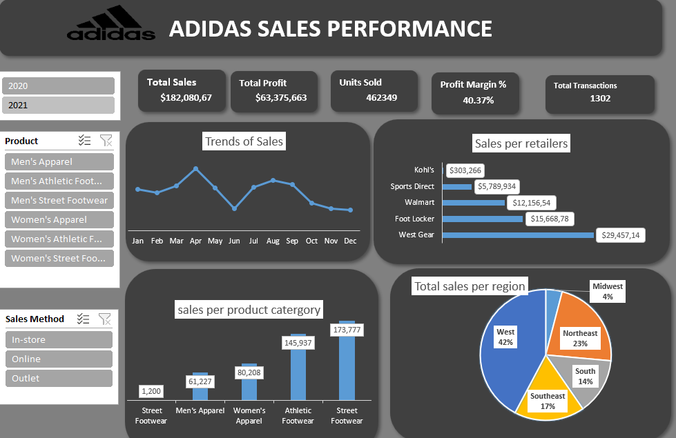

# 📊 Adidas US Sales Analysis (Excel Dashboard)

### 🚀 Project Overview
This project analyzes **Adidas US Sales Data** to identify key performance indicators (KPIs) driving revenue and operating profit. 

As an **Electrical Engineering student transitioning into Data Analytics**, I approached this dataset with a "systems" mindset—treating raw data like a signal that needed to be cleaned of noise before being processed for insights. The goal was to transform **raw transactional records** into an interactive dashboard that supports business decision-making.

---

### 📂 The Dataset
* **Source:** Adidas US Sales Dataset (Kaggle/Public Domain)
* **Volume:** ~10,000 Records
* **Key Metrics:** Total Sales ($182M), Operating Profit ($63M), Units Sold (462k)
* **Dimensions:** Region, Retailer, Product Category, Sales Method (Online vs In-store)

---

### ⚙️ Methodology: The "Engineering" Approach to Data
I followed a structured workflow to ensure data integrity before analysis:

#### 1. Data Cleaning (Signal Processing) 🛠️
* **Standardization:** Converted mixed date formats into a uniform `Date` type for time-series analysis.
* **Noise Removal:** Identified and handled null values in the 'Region' and 'Retailer' columns to prevent calculation errors.
* **Validation:** Verified the "Total Sales" column by recalculating `Price per Unit * Units Sold` to ensure formula accuracy.

#### 2. Data Modeling & Analysis 📉
* Used **Pivot Tables** to aggregate millions of data points into summary statistics.
* Segmented data by **Region** and **Product Category** to isolate high-margin areas.
* Calculated **Operating Margin %** to identify the most profitable sales channels.

#### 3. Visualization (Dashboarding) 📊
Built an interactive Excel Dashboard featuring:
* **Slicers:** For dynamic filtering by Year and Region.
* **Trend Lines:** Visualizing sales spikes across Q1-Q4.
* **Bar Charts:** Comparing "Street Footwear" vs. "Athletic Footwear" performance.

---

### 💡 Key Business Insights
1.  **Revenue Volume:** The analysis confirmed a Total Sales Volume of **$182M**, with an Operating Profit of **$63M** (~35% margin).
2.  **Product Performance:** **Street Footwear** significantly outperformed other categories in terms of Operating Profit, suggesting a shift in consumer preference toward casual style over performance gear.
3.  **Regional Variance:** The **West Region** showed the highest volume of "In-store" sales, whereas the Northeast relied more heavily on Outlet sales.

---

### 📸 Dashboard Screenshots

---

### 🛠️ Tools Used
* **Microsoft Excel:** Power Query, Pivot Tables, Advanced Formulas, Slicers.
* **Data Cleaning:** Text-to-Columns, Remove Duplicates, Conditional Formatting.

---

### 📥 How to Use This File
1.  **Download** the file `[addidas sales analysis.xlsx]`(addidas sales analysis.xlsx) from this repository.
2.  Open the file in **Microsoft Excel**.
3.  Navigate to the **"Dashboard"** tab.
4.  Use the **Slicers** on the left to filter the data by Region or Date.

---

### 📬 Contact
AKinyemi samuel J Electrical Engineering Student | Aspiring Data Analyst  
www.linkedin.com/in/samuel-akinyemi-59995b32b

